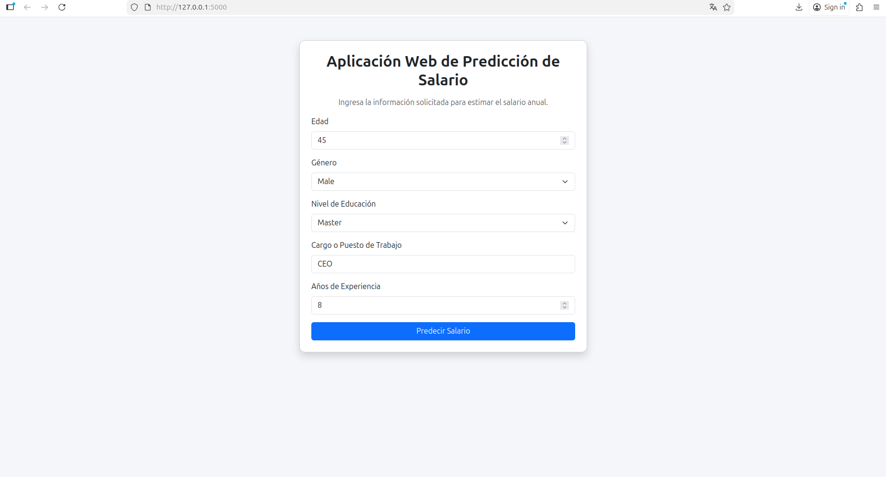
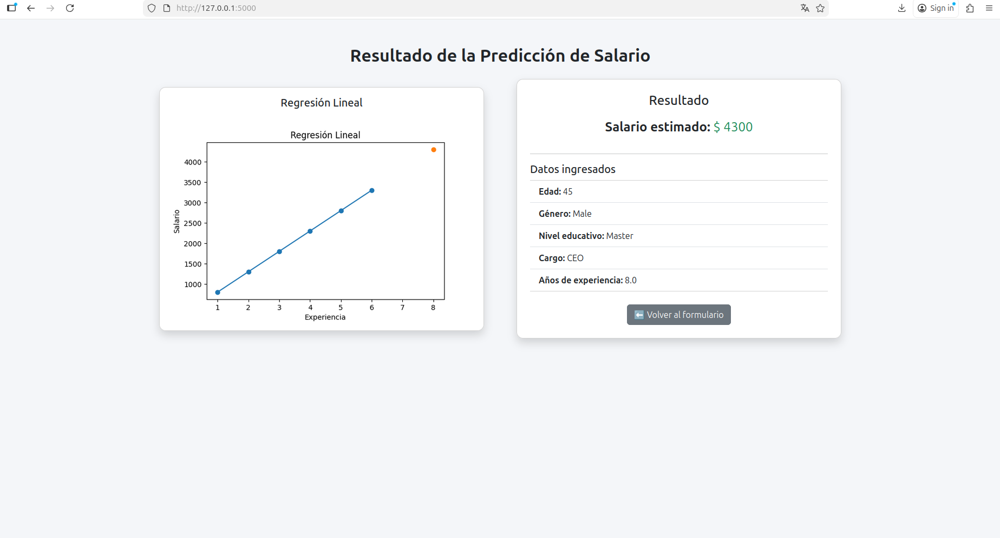
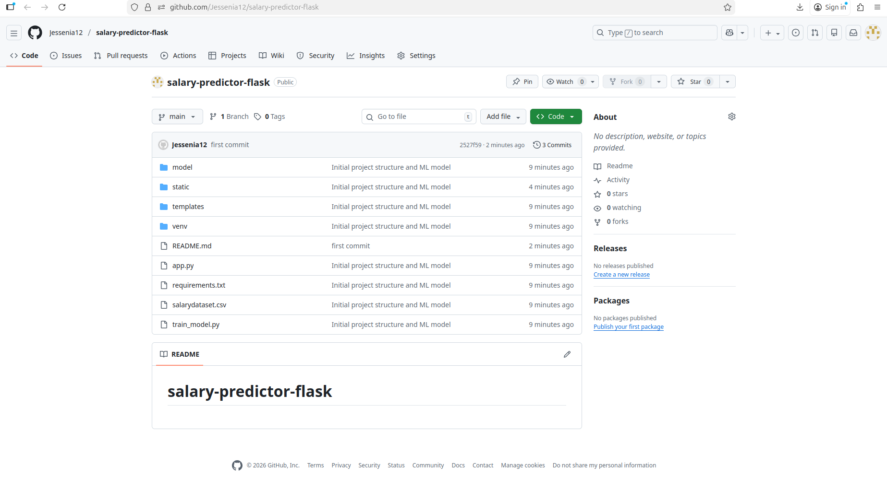
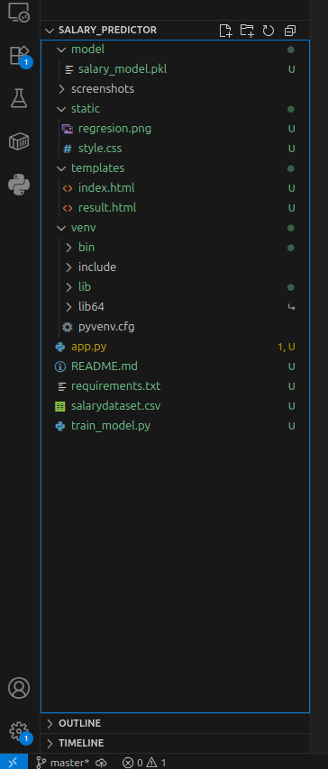

# salary-predictor-flask

## Results & Screenshots

### Form Page

Esta imagen muestra la página principal del formulario, donde el usuario ingresa los datos necesarios (edad, género, nivel educativo, puesto de trabajo y años de experiencia) para realizar la predicción del salario.

---

### Prediction Result

En esta captura se observa el resultado de la predicción del salario, junto con los datos ingresados por el usuario y el valor estimado generado por el modelo de Machine Learning.

---

### GitHub Repository

Esta imagen corresponde al repositorio público en GitHub, donde se puede verificar la estructura del proyecto, el historial de commits y los archivos requeridos para la entrega.

---

### Project Structure

Esta captura muestra la estructura del proyecto organizada en carpetas y archivos, cumpliendo con los requisitos solicitados en la actividad (app.py, templates, static, screenshots, entre otros).

